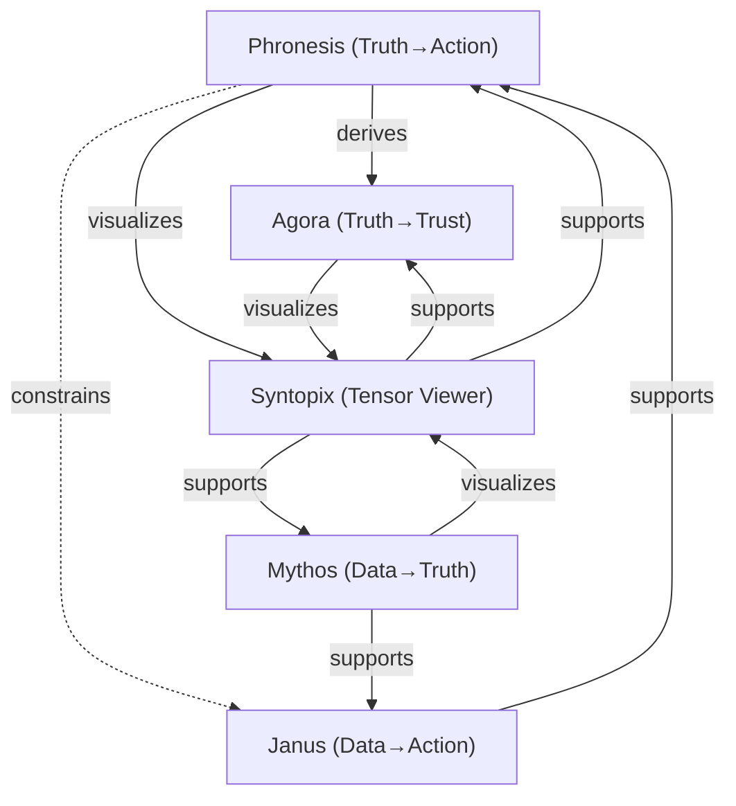

# Holon Tensor Index

This file introduces a lightweight **YAML tensor schema** to describe vaults as epistemic **vectors** and their relationships as **tensor links**. You can keep it here for now and later split each entry into its own note for Dataview queries.

---

## 1) YAML Tensor Schema (template)

```yaml
# one entity = one vault, project, or major holon
id: <kebab-id>            # unique id, kebab-case
label: <Display Name>     # human label
kind: vault               # vault | project | dataset | service
axis_from: Truth          # conceptual origin (e.g., Data, Truth, Trust, Action)
axis_to: Trust            # conceptual destination (e.g., Truth, Trust, Action, Praxis)
axes:                     # optional: list of basis axes used by this vector
  - Data
  - Truth
  - Trust
  - Action
magnitude: 0.0..1.0       # rough strength/weight of this vector (subjective)
state: active             # active | draft | archived
owners: [Michael]         # accountable people/teams
links:                    # tensor links from this entity to others
  - target: <other-id>
    relation: supports    # supports | derives | constrains | visualizes | finances | operationalizes
    weight: 0.0..1.0
    notes: <why this link matters>
notes: >
  Free-form description.
```

> Tip: when you break entries into separate notes later, put the YAML at the **top** as frontmatter (between `---` lines). Then Dataview can query across files easily.

---

## 2) Instances (current best view)

### 2.1 Phronesis (core)
```yaml
id: phronesis
label: Phronesis Projects
kind: vault
axis_from: Truth
axis_to: Action
axes: [Data, Truth, Trust, Action]
magnitude: 0.92
state: active
owners: [Michael]
links:
  - target: agora
    relation: derives
    weight: 0.8
    notes: Moral reasoning outputs feed collective synthesis.
  - target: syntopix
    relation: visualizes
    weight: 0.7
    notes: Phronesis results become visualizable holons/topiqx.
  - target: janus
    relation: constrains
    weight: 0.6
    notes: Practical wisdom constrains financial decisions and narratives.
notes: >
  Home of practical wisdom measurement (SPM), virtue models, and civic praxis.
```

### 2.2 Agora (synthesis)
```yaml
id: agora
label: Agora
kind: vault
axis_from: Truth
axis_to: Trust
axes: [Truth, Trust]
magnitude: 0.88
state: active
owners: [Michael]
links:
  - target: phronesis
    relation: supports
    weight: 0.8
    notes: Hosts dialogues that refine and test Phronesis outputs.
  - target: syntopix
    relation: visualizes
    weight: 0.9
    notes: Aggregates cross-vault holons for public synthesis.
notes: >
  Collective intelligence: cooperative reasoning, provenance, and shareable tools.
```

### 2.3 Janus (finance & decisions)
```yaml
id: janus
label: Janus
kind: vault
axis_from: Data
axis_to: Action
axes: [Data, Truth, Action]
magnitude: 0.85
state: active
owners: [Michael]
links:
  - target: phronesis
    relation: supports
    weight: 0.6
    notes: Financial models operationalize practical wisdom trade-offs.
  - target: mythos
    relation: derives
    weight: 0.5
    notes: Pulls empirical inputs from operations/inventory.
notes: >
  Proforma checkbook, liquidity gaps, BNPL modeling; turns numbers into choices.
```

### 2.4 Mythos Inventory (empirical grounding)
```yaml
id: mythos
label: Mythos Inventory
kind: vault
axis_from: Data
axis_to: Truth
axes: [Data, Truth]
magnitude: 0.8
state: active
owners: [Michael]
links:
  - target: janus
    relation: supports
    weight: 0.5
    notes: Provides empirical product/lot/ship data for financial reasoning.
  - target: syntopix
    relation: visualizes
    weight: 0.6
    notes: Inventory graphs and reconciliations as holons.
notes: >
  SKUs, lots, shipments, reconciliation PDFs; operational source-of-truth.
```

### 2.5 Syntopix (graph & spaces)
```yaml
id: syntopix
label: Syntopix
kind: project
axis_from: Truth
axis_to: Trust
axes: [Truth, Trust, Action]
magnitude: 0.9
state: active
owners: [Michael]
links:
  - target: agora
    relation: supports
    weight: 0.9
    notes: Renders cross-vault synthesis; Spaces, Topiqx, provenance.
  - target: phronesis
    relation: supports
    weight: 0.7
    notes: Visual analytics for SPM and virtue layers.
  - target: mythos
    relation: supports
    weight: 0.6
    notes: Dashboards for inventory truth-maintenance.
notes: >
  The tensor viewer—connects vectors (vaults) into navigable holons.
```

---

## 3) Quick visualization (Mermaid)



---

## 4) Evolve toward a queryable index

**Now:** keep this single file.  
**Next:** move each YAML block into the **frontmatter** of its own note (e.g., `projects/index/agora.tensor.md`). Then a simple Dataview query like:

```dataview
TABLE label, kind, axis_from, axis_to, magnitude, state
FROM "projects/index"
WHERE id
SORT label ASC
```

Once split, you can also add a light **validation checklist** to each note (is `id` unique? do all `links.target` exist?).

---

**Working rule of thumb:**  
- New vector? Create a note with this YAML.  
- New relationship? Add a `links` entry in the **source** note (direction matters).  
- If you feel a link is asymmetric, model both directions with distinct `relation` verbs.
