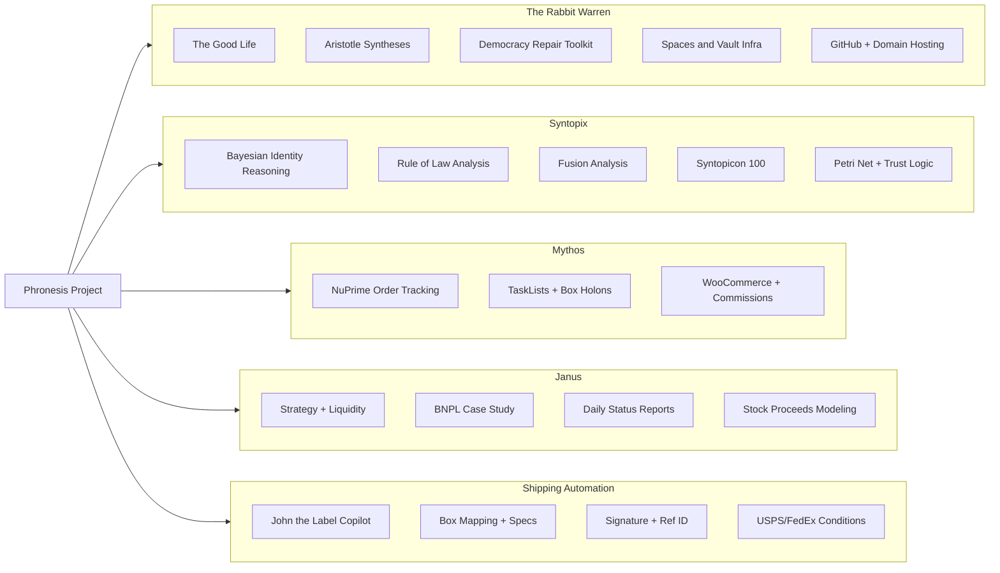

The Phronesis vault is the main entry point to all Phronesis Projects.
# Phronesis Project: Master Graph

## 🧠 Phronesis (Root Vault)

### ▸ The Rabbit Warren
- The Good Life (Poster child)
- Aristotle Syntheses (Virtue, Action, Identity)
- Democracy Repair Toolkit
- Spaces and Vaults infrastructure
- GitHub + Domain Hosting Plan

### ▸ Syntopix
- Bayesian Identity Reasoning
- Rule of Law Analysis
- Fusion Analysis (Econ + Defense)
- Syntopicon 100: Great Ideas Index
- Petri Net + Trust Logic Experiments

### ▸ Mythos
- NuPrime Dealer + Online Order Tracking
- TaskList + Box Holons + Shipping Docs
- WooCommerce & Commissions Integration

### ▸ Janus
- Strategy & Liquidity Planner
- BNPL Case Study (Seniors & Income Timing)
- Daily Status Reports (MidOr, LOCs, Income)
- Stock Proceeds + Cashflow Modeling

### ▸ USPS/FedEx Automation
- John the Label Copilot
- Box Mapping + Product Specs
- Signature + Reference ID Logic
- USPS vs. FedEx Condition Handling

